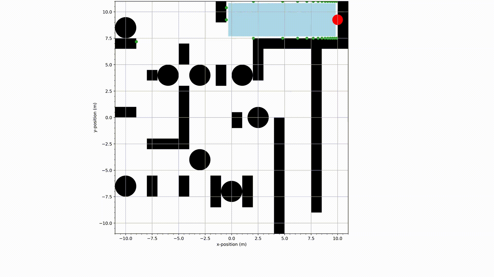
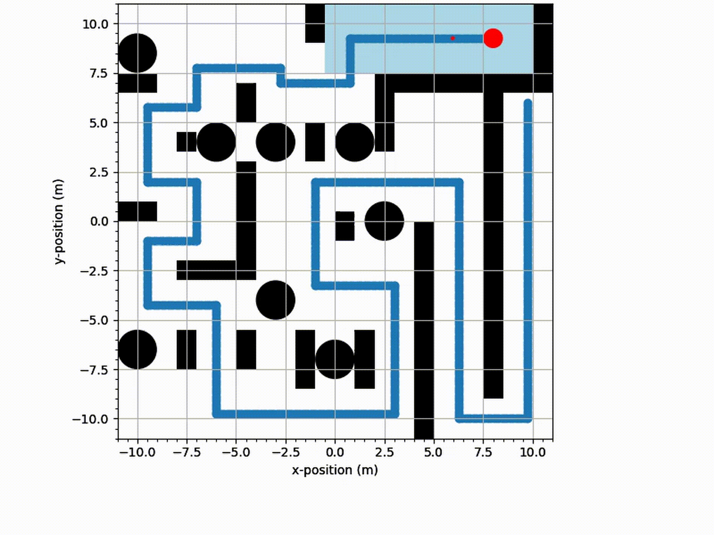
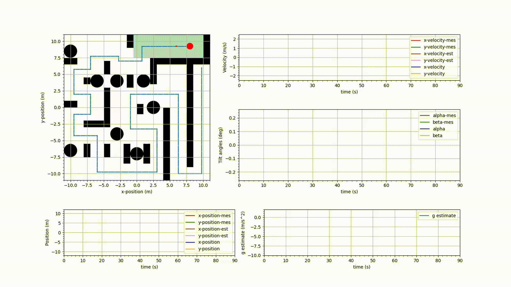

## MPC Brio Labyrinth

Solving Brio labyrinth using MPC. A paper I recently read, titled _Adaptive Nonlinear Model Predictive Control for a Real-World Labyrinth Game_ [1] by Johannes Gaber et.al., inspired this project.

In [1], the authors have used 2 MPCs, one high-level and one low-level, to solve the labyrinth. The high-level controller generates optimal trajectories for the low-level controller, which then controls the ball to follow the computed trajectory.

In the paper, the high-level controller takes into account all the wall and hole constraints for computing the optimal trajectory. The constraints make the space non-convex, and because the dynamics of the system are non-linear, finding solutions for the formulated optimal control problem is computationally heavy.

In this project, to avoid computational complexity, instead of using a 2-level controller architecture and taking non-convex constraints, I intend to compute a local feasible convex set around the ball's current position at every instant and use this as the constraint set.

The goal at each iteration would be to make the ball reach the furthest point (on the solution path towards the goal) in the computed convex set. The Idea is to combine this with linearised dynamics, which would yield a convex optimisation problem, which could be solved efficiently.

We approach the project's development in 2 stages.
1. To develop an initial framework to compute the convex sets as the ball navigates through the labyrinth.
2. To formulate the MPC and solve the labyrinth.

## Stage 1: Initial framework to compute feasible convex sets.
This work is done, and a demo script is provided in [_convex_set_demo.py_](convex_set_demo.py) file. Below is a demo gif (it has been slowed down for demonstration, and doesn't reflect the actual computational time).

In the GIF above, the red circle represents the ball, and the light blue colour polygon represents the computed convex set at each ball position throughout the labyrinth.

## Stage 2: Simulation of the setup.
## Part A: Simulation using Linear dynamics.
Usage: Run [_optimiser.py_](optimiser.py) to build the MPC formulation. Then run [_main.py_](main.py) to simulate the setup. There should be an mp4 media file generated under the name _Linear\_dyn\_simulation\_with\_feasible\_convex\_sets.mp4_ with the simulation results. 

In part A of stage 2, only the linearized dynamics of the labyrinth were used to simulate the MCP at work. Below is a GIF showcasing the results of the simulation. The MCP was able to solve the (20m x 20m) labyrinth in 90 seconds of simulation time.

In the above GIF, the larger red circle represents the steel ball, the smaller red circle represents position reference for the MPC, and the collection blue dots represents the solution path of the labyrinth.

As it can be seen from the above GIF, the MPC successfully solves the labyrinth. But this simulation is based on the linearized dynamics of the labyrinth setup. 

## Part B: Complete simulation.

The complete setup is as follows:
The MPC formulation uses the linearized dynamics, having states [x, vx, y, vy, alpha, beta], with the computed (convex) rectangular bounds as constraints. This formulation is posed as a convex QP. This type of formulation can be solved very efficiently and is the primary reason for selecting such an approach. The simulation, MPC and the Kalman Filter (KF) are updated at 10hz rate and was enough to solve the labyrinth. 

Higher update frequencies are possible due to the efficiency of this approach and the reader can test it out by updating Ts in _main.py_ and [_optimiser.py_](optimiser.py). Remember to run [_optimiser.py_](optimiser.py) first and then run _main.py_ for results. The simulation time _sim\_time_ in [_main.py_](main.py) and the plots' x and y limits in [_animator.py_](animator.py) might need adjusted accordingly.

The simulation environment computes the states using non-linear dynamics. On the other hand, the Kalman Filter algorithm utilises time-varying dynamics to estimate the states [x, vx, y, vy, g]. Here g is the acceleration due to gravity, and is estimated as a means of sanity check for the system. We shall see the estimates of g converge to and hover around $-9.81$ during the simulation.

Simulation steps:
1. At each time step, the states [x, vx, y, vy, alpha, beta] of the system are measured as actual states added with noise.
2. These states are fed to the KF algorithm, with [x, y] + noise as state measurements. The states [alpha, beta] + noise are used to update the time-varying dynamics. The algorithm computes the estimates of [xe, vxe, ye, vye, ge]. 
3. The estimates [xe, ye] are used to compute the (convex) rectangular bounds for ball position constraints. 
4. A position reference [xr, yr] is computed on a pre-determined solution path sampled at 10 samples per meter. The ball's current position is projected on to the path and the reference position position is selected as the solution path point that is 20 indices ahead of the projection. 
5. With [xe, ye] as current position, [xr, 0, yr, 0, 0, 0] as reference, and the computed convex set as position bounds, an MPC problem is formulated and solved for motor speed inputs [wa, wb] (or [alpha_dot, beta_dot]). 
6. The computed control actions [wa, wb] are applied to the non-linear system and the next states are determined. These states are again used in step 1.

Below is a GIF showcasing the corresponding simulation results.

Note: There are no wall dynamics in the simulation environment.

As it can be seen from the above GIF, despite noisy measurements, the MPC successfully solves the labyrinth. IT can also be obeserved that the estimates of g converge to a value around $-9.81 \frac{\text{m}}{\text{s}^2}$. A complete and proper explanation of the approach will be soon published on [my website](https://patchedbybatman.github.io).

## References
[1] J. Gaber, T. Bi and R. D’Andrea, "Adaptive Nonlinear Model Predictive Control for a Real-World Labyrinth Game," 2024 IEEE 63rd Conference on Decision and Control (CDC), Milan, Italy, 2024, pp. 7478-7483, doi: 10.1109/CDC56724.2024.10886880. keywords: {Adaptation models;Computational modeling;Games;Predictive models;Real-time systems;Robustness;Trajectory;Springs;Optimization;Predictive control},

